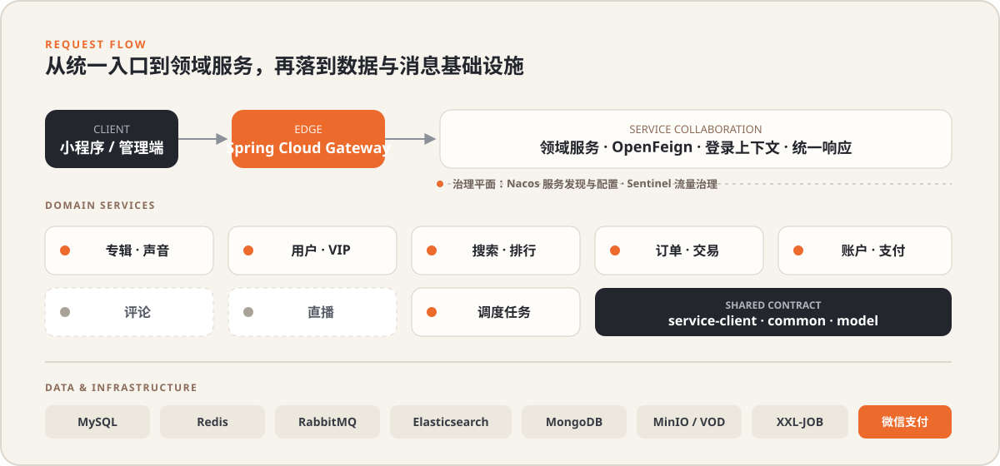

<div align="center">
  

  <br />

  <a href="#核心能力">核心能力</a> ·
  <a href="#系统架构">系统架构</a> ·
  <a href="#模块地图">模块地图</a> ·
  <a href="#快速开始">快速开始</a> ·
  <a href="#项目边界">项目边界</a>

  <br /><br />

  
  
  
  
</div>

## 项目简介

TingShu 是一个面向音频内容消费场景的 Java 微服务后端，围绕“发现内容、收听声音、购买权益、完成支付”组织业务能力。项目采用 Spring Cloud Gateway、Nacos 与 OpenFeign 拆分服务边界，并组合 Redis、RabbitMQ、Elasticsearch、MongoDB、MinIO 等基础设施处理缓存、异步消息、搜索与媒体存储。

> [!IMPORTANT]
> 本仓库持续开发中。下文的“已实现”仅表示当前源码中存在对应控制器与业务调用链，不等同于生产可用、全链路联调完成或外部基础设施已验证。

## 核心能力

| 业务域 | 当前源码能力 | 关键设计 |
| --- | --- | --- |
| 内容生产 | 专辑与声音的创建、编辑、分页、上下架相关数据处理 | MyBatis-Plus、MinIO、腾讯云 VOD |
| 内容发现 | 分类树、频道页、搜索建议、专辑检索与排行榜 | Elasticsearch、Redis、定时更新 |
| 用户与权益 | 微信登录、用户资料、VIP 配置、购买记录、收听进度 | 登录切面、ThreadLocal 上下文、Redis |
| 交易订单 | 订单确认、提交、查询、取消，支持专辑/VIP/声音分集购买 | Feign 聚合、交易号防重、延迟取消 |
| 账户支付 | 余额校验与扣减、充值单、微信 JSAPI/Native 支付及回调 | RabbitMQ、微信支付 SDK、幂等状态判断 |
| 播放统计 | 收听进度保存、最近播放、异步播放量更新 | RabbitMQ 消费、Redis 去重、MongoDB/MySQL |

## 系统架构

<div align="center">
  
</div>

一次典型的购买调用链如下：

```text
客户端
  └─ Gateway
      └─ service-order：确认交易 / 提交订单
          ├─ service-user：用户、VIP 与已购权益
          ├─ service-album：专辑与声音信息
          ├─ service-account：余额校验与扣减
          └─ service-payment：微信支付、查询与回调
                 └─ RabbitMQ：支付结果与延迟取消消息
```

## 模块地图

| 模块 | 职责 | 状态说明 |
| --- | --- | --- |
| `server-gateway` | 统一入口、路由转发 | 已有路由骨架；生产级鉴权与边界策略仍需完善 |
| `service-album` | 分类、专辑、声音、上传、播放统计 | 主要业务实现持续完善中 |
| `service-user` | 微信登录、用户、VIP、已购记录、收听进度 | 主要业务实现持续完善中 |
| `service-search` | 专辑检索、补全建议、排行榜、频道页 | 依赖 Elasticsearch 与缓存数据 |
| `service-order` | 交易确认、下单、订单查询、取消 | 已接入账户、用户、专辑等 Feign 调用 |
| `service-account` | 余额、消费记录、充值单 | 与订单及支付流程协作 |
| `service-payment` | 微信支付下单、查询、通知处理 | 需要外部商户配置与公网回调环境 |
| `service-dispatch` | 调度任务 | 依赖 XXL-JOB 调度中心 |
| `service-live` / `service-comment` | 直播与评论领域 | 当前能力有限，仍在建设 |
| `service-client` | 服务间 OpenFeign 契约与降级实现 | 被业务服务复用 |
| `common` / `model` | 公共配置、消息工具、统一模型与校验 | 基础共享模块 |

<details>
<summary><strong>查看仓库目录</strong></summary>

```text
TingShu/
├─ config/nacos/DEFAULT_GROUP/   # 脱敏后的 Nacos 配置模板
├─ docs/                         # 审查记录与项目资料
└─ tingshu-parent/
   ├─ common/                    # 公共能力
   ├─ model/                     # Entity / DTO / VO
   ├─ server-gateway/            # API 网关
   ├─ service/                   # 业务微服务
   └─ service-client/            # Feign 客户端契约
```

</details>

## 技术栈

| 层次 | 组件 |
| --- | --- |
| 基础框架 | Java 17、Spring Boot 3.0.5、Spring Cloud 2022.0.2 |
| 服务治理 | Spring Cloud Alibaba、Nacos、OpenFeign、Sentinel |
| 数据访问 | MyBatis-Plus、MySQL、MongoDB |
| 缓存与协调 | Redis、Redisson |
| 搜索与消息 | Elasticsearch、RabbitMQ |
| 媒体与任务 | MinIO、腾讯云 VOD、XXL-JOB |
| 支付 | 微信支付 Java SDK |

## 快速开始

### 1. 环境准备

- JDK 17（本项目旧版 Lombok 与 JDK 21 存在兼容风险）
- Maven 3.9+
- Nacos、MySQL、Redis、RabbitMQ
- 按启动模块补充 Elasticsearch、MongoDB、MinIO、XXL-JOB 等依赖

### 2. 获取与构建

```powershell
git clone https://github.com/2813078120ggup-cyber/TingShu.git
Set-Location TingShu
mvn -B -ntp -f .\tingshu-parent\pom.xml "-DskipTests=false" "-Dmaven.test.skip=false" verify
```

> [!NOTE]
> Maven 构建通过只代表编译、打包和仓库内测试通过，不代表 Nacos、数据库、消息队列、搜索、对象存储或支付链路已经联通。

### 3. 准备配置

1. 阅读 [Nacos 配置说明](config/nacos/README.md)。
2. 将 `config/nacos/DEFAULT_GROUP/` 中需要的模板按原文件名导入 Nacos。
3. 通过环境变量或受控配置中心提供数据库、缓存、对象存储、微信等真实凭据。
4. 按需启动网关与业务服务；建议从单个业务域开始验证，再逐步补齐依赖。

常用外部密钥：

| 用途 | 环境变量 | JVM 系统属性（优先） |
| --- | --- | --- |
| 订单签名 | `ORDER_SIGN_KEY` | `tingshu.order.sign-key` |
| 直播推流签名 | `LIVE_PUSH_KEY` | `tingshu.live.push-key` |

支付私钥通过 `wechat.v3pay.privateKeyPath` 指向进程外部文件。请勿将私钥、证书、真实密码或云服务密钥提交到仓库。

## 项目边界

- 仓库当前聚焦后端服务，不包含前端源码、数据库建表/初始化 SQL 和 `service-system` 实现。
- Nacos 目录提供的是脱敏接入模板，不是可直接用于生产的配置。
- 直播、评论与网关安全边界仍需继续建设；文件上传、依赖版本与外部调用也需要在上线前完成专项安全复核。
- 历史初始化审查见 [代码审查记录](docs/CODE_REVIEW.md)。该文档反映 2026-08-31 的仓库快照，不能替代对当前代码的重新审查。

## 参与开发

欢迎通过 Issue 描述问题或改进建议。提交变更前请确保：

```powershell
git diff --check
mvn -B -ntp -f .\tingshu-parent\pom.xml "-DskipTests=false" "-Dmaven.test.skip=false" verify
```

请保持改动聚焦，不提交本地配置、日志、构建产物或任何敏感凭据。

<div align="center">
  <sub>让每一次播放、购买与支付，都能沿着清晰可靠的服务链路完成。</sub>
</div>
